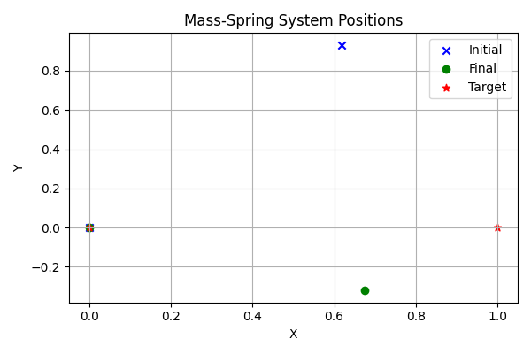

# Differentiable Physics: Mass-Spring System

This example demonstrates a simple differentiable **mass-spring system** using PyTorch.

A set of particles is connected via springs and evolves over time under the influence of:
- **Spring forces** (via Hooke’s Law)
- **Gravity** (acting in the negative Y-direction)

The system is fully differentiable, enabling **gradient-based optimization** of the **initial positions** of the particles so that their **final positions** match a desired **target configuration**.

This idea is inspired by differentiable simulation frameworks such as those presented in recent research (see reference below).

---

##  Files

- `mass_spring.py` — Implements the simulation, training loop, and evaluation logic.
- `README.md` — Description, instructions, and visualization output.
- `mass_spring_viz.png` — Output visualization of the final vs target configuration.

---

##  Key Concepts

| Term              | Description                                                                 |
|-------------------|-----------------------------------------------------------------------------|
| Initial Position  | Learnable 2D coordinates (x, y) of each particle before simulation begins.  |
| Target Position   | Desired final 2D position after simulation. Used to compute loss.           |
| Gravity           | Constant force `[0, -9.8]` pulling particles downward in Y direction.       |
| Spring Forces     | Modeled using Hooke’s Law. Particles connected by springs exert forces.     |
| Dimensionality    | All particle positions and forces are 2D vectors.                           |

---

## Requirements

- Python 3.8+
- PyTorch ≥ 2.0

Install requirements (if needed):
```bash
pip install -r requirements.txt


## Usage

First, ensure PyTorch is installed.

#### Train the system

```bash
python mass_spring.py --mode train




*Mass-Spring System Visualization comparing final vs target positions.*


## References

[1] Sanchez-Gonzalez, A. et al. (2020).  
Learning to Simulate Complex Physics with Graph Networks.  
arXiv preprint arXiv:2002.09405.  
Available: https://arxiv.org/abs/2002.09405


