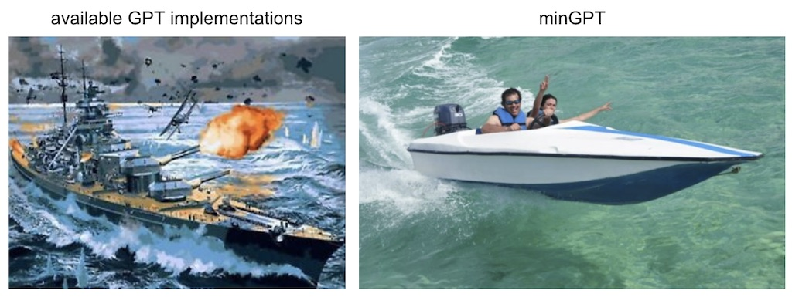

# minGPT



A PyTorch re-implementation of [GPT](https://github.com/openai/gpt-2), both training and inference. minGPT tries to be small, clean, interpretable and educational, as most of the currently available GPT model implementations can a bit sprawling. GPT is not a complicated model and this implementation is appropriately about 300 lines of code (see [mingpt/model.py](mingpt/model.py)). All that's going on is that a sequence of indices feeds into a [Transformer](https://arxiv.org/abs/1706.03762), and a probability distribution over the next index in the sequence comes out. The majority of the complexity is just being clever with batching (both across examples and over sequence length) for efficiency.

The minGPT library is three files: [mingpt/model.py](mingpt/model.py) contains the actual Transformer model definition, [mingpt/bpe.py](mingpt/bpe.py) contains a mildly refactored Byte Pair Encoder that translates between text and sequences of integers exactly like OpenAI did in GPT, [mingpt/trainer.py](mingpt/trainer.py) is (GPT-independent) PyTorch boilerplate code that trains the model. Then there are a number of demos and projects that use the library in the `projects` folder:

- `projects/adder` trains a GPT from scratch to add numbers (inspired by the addition section in the GPT-3 paper)
- `projects/chargpt` trains a GPT to be a character-level language model on some input text file
- `demo.ipynb` shows a minimal usage of the `GPT` and `Trainer` in a notebook format on a simple sorting example
- `generate.ipynb` shows how one can load a pretrained GPT2 and generate text given some prompt

### Library Installation

If you want to `import mingpt` into your project:

```
git clone https://github.com/karpathy/minGPT.git
cd minGPT
pip install -e .
```

### Usage

Here's how you'd instantiate a GPT-2 (124M param version):

```python
from mingpt.model import GPT
model_config = GPT.get_default_config()
model_config.model_type = 'gpt2'
model_config.vocab_size = 50257 # openai's model vocabulary
model_config.block_size = 1024  # openai's model block_size (i.e. input context length)
model = GPT(model_config)
```

And here's how you'd train it:

```python
# your subclass of torch.utils.data.Dataset that emits example
# torch LongTensor of lengths up to 1024, with integers from [0,50257)
train_dataset = YourDataset()

from mingpt.trainer import Trainer
train_config = Trainer.get_default_config()
train_config.learning_rate = 5e-4 # many possible options, see the file
train_config.max_iters = 1000
train_config.batch_size = 32
trainer = Trainer(train_config, model, train_dataset)
trainer.run()
```

See `demo.ipynb` for a more concrete example.

### Unit tests

Coverage is not super amazing just yet but:

```
python -m unittest discover tests
```

### todos

- add gpt-2 finetuning demo on arbitrary given text file
- add dialog agent demo
- better docs of outcomes for existing projects (adder, chargpt)
- add mixed precision and related training scaling goodies
- distributed training support
- reproduce some benchmarks in projects/, e.g. text8 or other language modeling
- proper logging instead of print statement amateur hour haha
- i probably should have a requirements.txt file...
- it should be possible to load in many other model weights other than just gpt2-\*

### References

Code:

- [openai/gpt-2](https://github.com/openai/gpt-2) has the model definition in TensorFlow, but not the training code
- [openai/image-gpt](https://github.com/openai/image-gpt) has some more modern gpt-3 like modification in its code, good reference as well
- [huggingface/transformers](https://github.com/huggingface/transformers) has a [language-modeling example](https://github.com/huggingface/transformers/tree/master/examples/pytorch/language-modeling). It is full-featured but as a result also somewhat challenging to trace. E.g. some large functions have as much as 90% unused code behind various branching statements that is unused in the default setting of simple language modeling

Papers + some implementation notes:

#### Improving Language Understanding by Generative Pre-Training (GPT-1)

- Our model largely follows the original transformer work
- We trained a 12-layer decoder-only transformer with masked self-attention heads (768 dimensional states and 12 attention heads). For the position-wise feed-forward networks, we used 3072 dimensional inner states.
- Adam max learning rate of 2.5e-4. (later GPT-3 for this model size uses 6e-4)
- LR decay: increased linearly from zero over the first 2000 updates and annealed to 0 using a cosine schedule
- We train for 100 epochs on minibatches of 64 randomly sampled, contiguous sequences of 512 tokens.
- Since layernorm is used extensively throughout the model, a simple weight initialization of N(0, 0.02) was sufficient
- bytepair encoding (BPE) vocabulary with 40,000 merges
- residual, embedding, and attention dropouts with a rate of 0.1 for regularization.
- modified version of L2 regularization proposed in (37), with w = 0.01 on all non bias or gain weights
- For the activation function, we used the Gaussian Error Linear Unit (GELU).
- We used learned position embeddings instead of the sinusoidal version proposed in the original work
- For finetuning: We add dropout to the classifier with a rate of 0.1. learning rate of 6.25e-5 and a batchsize of 32. 3 epochs. We use a linear learning rate decay schedule with warmup over 0.2% of training. λ was set to 0.5.
- GPT-1 model is 12 layers and d_model 768, ~117M params

#### Language Models are Unsupervised Multitask Learners (GPT-2)

- LayerNorm was moved to the input of each sub-block, similar to a pre-activation residual network
- an additional layer normalization was added after the final self-attention block.
- modified initialization which accounts for the accumulation on the residual path with model depth is used. We scale the weights of residual layers at initialization by a factor of 1/√N where N is the number of residual layers. (weird because in their released code i can only find a simple use of the old 0.02... in their release of image-gpt I found it used for c_proj, and even then only for attn, not for mlp. huh. https://github.com/openai/image-gpt/blob/master/src/model.py)
- the vocabulary is expanded to 50,257
- increase the context size from 512 to 1024 tokens
- larger batchsize of 512 is used
- GPT-2 used 48 layers and d_model 1600 (vs. original 12 layers and d_model 768). ~1.542B params

#### Language Models are Few-Shot Learners (GPT-3)

- GPT-3: 96 layers, 96 heads, with d_model of 12,288 (175B parameters).
- GPT-1-like: 12 layers, 12 heads, d_model 768 (125M)
- We use the same model and architecture as GPT-2, including the modified initialization, pre-normalization, and reversible tokenization described therein
- we use alternating dense and locally banded sparse attention patterns in the layers of the transformer, similar to the Sparse Transformer
- we always have the feedforward layer four times the size of the bottleneck layer, dff = 4 ∗ dmodel
- all models use a context window of nctx = 2048 tokens.
- Adam with β1 = 0.9, β2 = 0.95, and eps = 10−8
- All models use weight decay of 0.1 to provide a small amount of regularization. (NOTE: GPT-1 used 0.01 I believe, see above)
- clip the global norm of the gradient at 1.0
- Linear LR warmup over the first 375 million tokens. Then use cosine decay for learning rate down to 10% of its value, over 260 billion tokens.
- gradually increase the batch size linearly from a small value (32k tokens) to the full value over the first 4-12 billion tokens of training, depending on the model size.
- full 2048-sized time context window is always used, with a special END OF DOCUMENT token delimiter

#### Generative Pretraining from Pixels (Image GPT)

- When working with images, we pick the identity permutation πi = i for 1 ≤ i ≤ n, also known as raster order.
- we create our own 9-bit color palette by clustering (R, G, B) pixel values using k-means with k = 512.
- Our largest model, iGPT-XL, contains L = 60 layers and uses an embedding size of d = 3072 for a total of 6.8B parameters.
- Our next largest model, iGPT-L, is essentially identical to GPT-2 with L = 48 layers, but contains a slightly smaller embedding size of d = 1536 (vs 1600) for a total of 1.4B parameters.
- We use the same model code as GPT-2, except that we initialize weights in the layerdependent fashion as in Sparse Transformer (Child et al., 2019) and zero-initialize all projections producing logits.
- We also train iGPT-M, a 455M parameter model with L = 36 and d = 1024
- iGPT-S, a 76M parameter model with L = 24 and d = 512 (okay, and how many heads? looks like the Github code claims 8)
- When pre-training iGPT-XL, we use a batch size of 64 and train for 2M iterations, and for all other models we use a batch size of 128 and train for 1M iterations.
- Adam with β1 = 0.9 and β2 = 0.95
- The learning rate is warmed up for one epoch, and then decays to 0
- We did not use weight decay because applying a small weight decay of 0.01 did not change representation quality.
- iGPT-S lr 0.003
- No dropout is used.

### License

MIT
