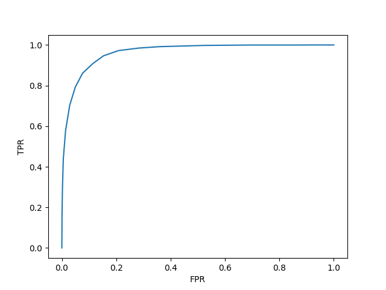
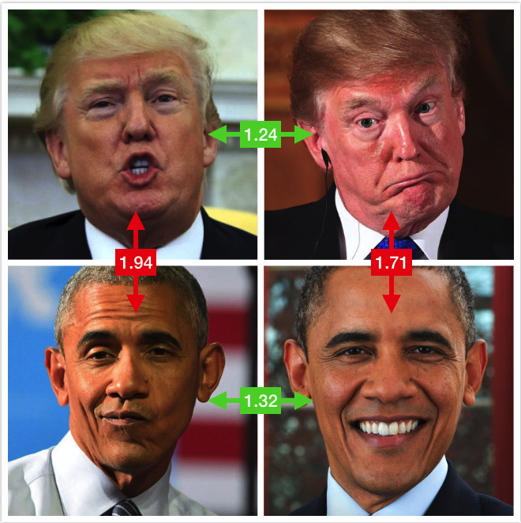

# center-loss.pytorch
Center loss implementation for face recognition in pytorch. Paper at: [A Discriminative Feature Learning Approach
for Deep Face Recognition](https://ydwen.github.io/papers/WenECCV16.pdf)

## Requirements

* Python 3.6
* Pytorch 0.4

## Usage

**Training** No need to download anything. The following command will create directorys and download everything automatically.

```
# For quick reference and small GPU ram
python3 main.py --arch resnet18 --batch_size 64 --epochs 50

# For a more solid model
python3 main.py

# or
python3 main.py --arch resnet50 --batch_size 256 --epochs 150
```

**Evaluation**

```
python3 main.py --evaluate ./logs/models/epoch_xx.pth.tar

# Model accuracy is 0.961722195148468
# ROC curve generated at /home/louis/center-loss.pytorch/logs/roc.png
```

**More Options**

```
usage: main.py [-h] [--batch_size N] [--log_dir LOG_DIR] [--epochs N]
               [--lr LR] [--arch ARCH] [--resume RESUME]
               [--dataset_dir DATASET_DIR] [--weights WEIGHTS]
               [--evaluate EVALUATE] [--pairs PAIRS] [--roc ROC]
               [--verify-model VERIFY_MODEL] [--verify-images VERIFY_IMAGES]

center loss example

optional arguments:
  -h, --help            show this help message and exit
  --batch_size N        input batch size for training (default: 256)
  --log_dir LOG_DIR     log directory
  --epochs N            number of epochs to train (default: 100)
  --lr LR               learning rate (default: 0.001)
  --arch ARCH           network arch to use, support resnet18 and resnet50
                        (default: resnet50)
  --resume RESUME       model path to the resume training
  --dataset_dir DATASET_DIR
                        directory with lfw dataset (default:
                        $HOME/datasets/lfw)
  --weights WEIGHTS     pretrained weights to load default:
                        ($LOG_DIR/resnet18.pth)
  --evaluate EVALUATE   evaluate specified model on lfw dataset
  --pairs PAIRS         path of pairs.txt (default: $DATASET_DIR/pairs.txt)
  --roc ROC             path of roc.png to generated (default:
                        $DATASET_DIR/roc.png)
  --verify-model VERIFY_MODEL
                        verify 2 images of face belong to one person,the param
                        is the model to use
  --verify-images VERIFY_IMAGES
                        verify 2 images of face belong to one person,split
                        image pathes by comma
```

## Experiments

Trained a model with default configuration(resnet50 for 100 epochs). The model can be downloaded from [Baidu Yun](https://pan.baidu.com/s/138sQCpHqImPjevvZMsVz3w) or [Google Drive](https://drive.google.com/open?id=1cQFwneObMeRc1KZF8959YGVbbYGvUhkp).

Results shown as follows:

```
python main.py --evaluate logs/models/epoch_100.pth.tar --batch_size 128

Model accuracy is 0.9628332853317261
ROC curve generated at /home/louis/center-loss.pytorch/logs/roc.png
```




## Random People Verification

2 images of Obama and 2 images of Trump. Verify 4 pairs together using the model.

```shell
➜ python main.py --verify-model logs/models/epoch_100.pth.tar --verify-images images/obama_a.png,images/obama_b.png
distance: 0.9222122430801392
➜ python main.py --verify-model logs/models/epoch_100.pth.tar --verify-images images/trump_a.png,images/trump_b.png
distance: 0.8140196800231934
➜ python main.py --verify-model logs/models/epoch_100.pth.tar --verify-images images/obama_a.png,images/trump_a.png
distance: 1.2879283428192139
➜ python main.py --verify-model logs/models/epoch_100.pth.tar --verify-images images/obama_b.png,images/trump_b.png
distance: 1.26639723777771
```



We can see that threshold of 1.1 will perfectly seperate them.

Due to the small dataset, this model is just for quick example reference. If one wants to use in production, change the feature extract network and train on a larger dataset.