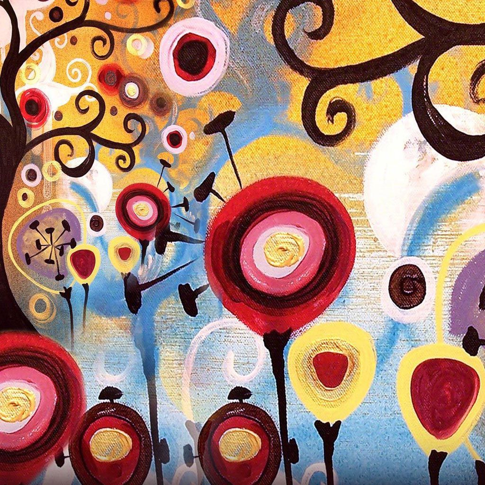
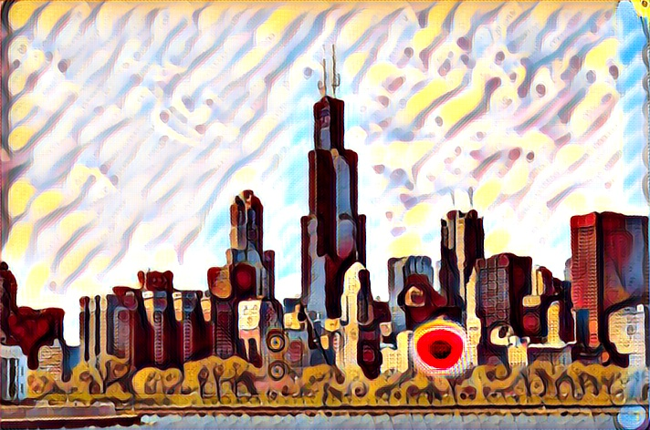
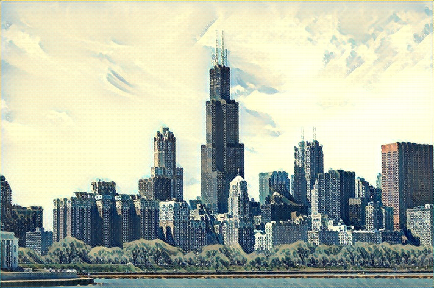
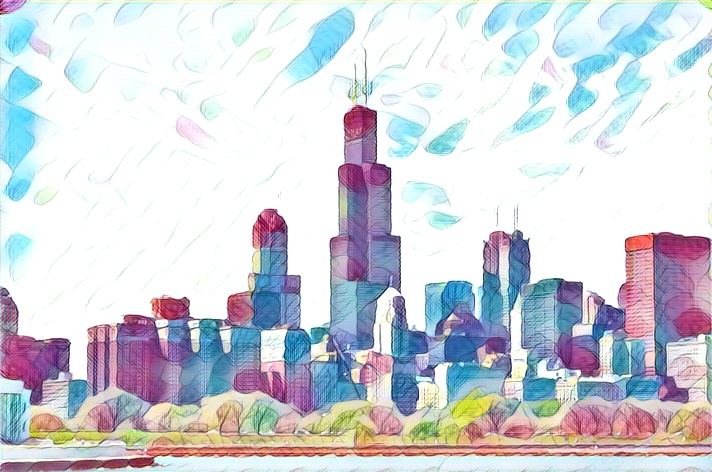

# Fast Neural Style

## Train
Download the MSCOCO 80k images dataset [Microsoft COCO dataset](http://mscoco.org/dataset/#download).
```
python train.py --style_image <style_image_path> --dataset <training_dataset_path>
```
Directory tree: ```training_dataset_path='../../dataset'```
```
|-dataset
|	|-train2014
|	|	|-xxxx.jpg
|	|	|-...
|-examples
|	|-fast_neural_style
|	|	|-train.py
```

## Generate
```
python generate.py --input <input_image_path> --model <model_path> --output <output_image_path>
```

## Models
### Example Results
<div align='center'>
  
</div>



<br>




### Pretrained Models
- [candy.pth](https://drive.google.com/file/d/0B7RIdSYNNb-uY0d4LXFHX0ppNG8/view?usp=sharing)
- [wave.pth](https://drive.google.com/file/d/0B7RIdSYNNb-uYnhzem53S29sVUU/view?usp=sharing)
- [feathers.pth](https://drive.google.com/file/d/0B7RIdSYNNb-uTVdRQjA3eS1ITDA/view?usp=sharing)


## Reference
- [chainer-fast-neuralstyle](https://github.com/yusuketomoto/chainer-fast-neuralstyle) Port from this chainer implementation.
- [Perceptual Losses for Real-Time Style Transfer and Super-Resolution](http://arxiv.org/abs/1603.08155)
