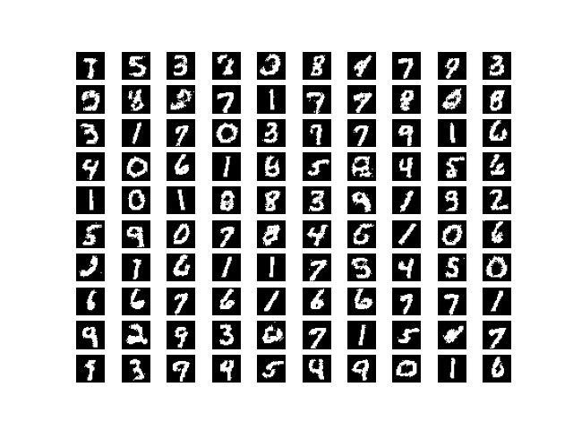

# Restricted Boltzmann Machine Example

This RBM implementation is based on the [deep learning book](https://www.deeplearningbook.org/) (page 656). The training algorithm used here is the naive MCMC algorithm for maximizing the log-likelihood using gradient ascent (algorithm 18.1, page 608) by burning the Markov chain from a random initialization every gradient step. The code could be modified to train with CD-k (algorithm 18.2, page 610) or PCD-k (algorithm 18.3, page 612).

## Getting Started

```bash
pip install -r requirements.txt
python main.py
```

## options:
``` 
  -h, --help       show this help message and exit
  --batch BATCH    Batch size for training.
  --epochs EPOCHS  Number of epochs for training.
  --lr LR          Learning rate for training.
  --nh NH          Number of hidden units for the RBM.
  --k K            Number of Gibbs steps during training
  --save           Save the model after training
```

## Models samples

